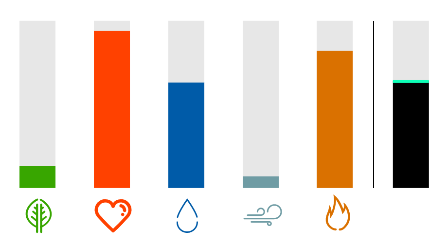

# MIND wizards

[MIND summer school](http://mindsummerschool.org/) project on wizards gem data provided from the [NRD lab](http://u.arizona.edu/~bob/) (PI: Robert Wilson, University of Arizona). 

This project addressed whether humans were able to learn linear regression weights from experience. Choices of estimated "gem" values were fit with models such as TD error, GP regression, attention and exemplar-based models using likelihood-based model-fitting. 

Contributors (alphabetical order): Julie Lee (UCL), Kate Nussenbaum (NYU), Mingyu Song (Princeton), Peter Hitchcock (Brown), Sevan Harootonian (University of Arizona), Stefan Uddenberg (Princeton)

